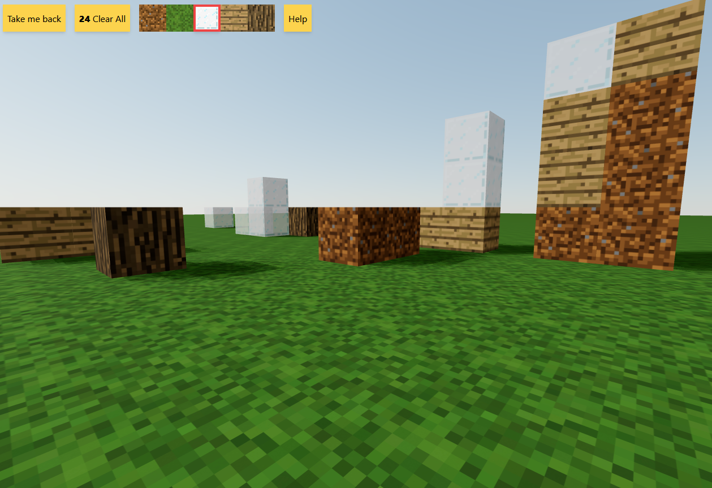

# Minecraft clone

I've tried recreating some of the main Minecraft actions with React hooks using [react-three-fiber](https://github.com/pmndrs/react-three-fiber), [drei](https://github.com/pmndrs/drei) and [cannon](https://github.com/pmndrs/use-cannon) when interacting with Three.js while the state is being managed with [zustand](https://github.com/pmndrs/zustand). All the styling was done with [tailwindcss](https://tailwindcss.com/).

> The game allows the player to navigate a plane using the keyboard and look around with the mouse (mobile is not supported yet, sorry). They can place/delete cubes with different textures when clicking. The game is autosaving the world every ten seconds so it can be reused and the user can clear everything with the reset button.

